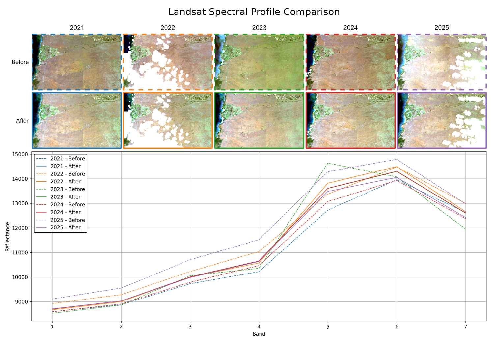

# spectralmatch: A toolkit to perform Relative Radiometric Normalization, with utilities for generating seamlines, cloud masks, Pseudo-Invariant Features, and statistics

[](#)
[](https://codecov.io/gh/spectralmatch/spectralmatch)
[](https://ssh.cloud.google.com/cloudshell/editor?cloudshell_git_repo=https://github.com/spectralmatch/spectralmatch&cloudshell_working_dir=.)
> [!IMPORTANT]
> This library is experimental and still under heavy development.
 
 ---

## Overview


*spectralmatch* provides a Python library and QGIS plugin with multiple algorythms to perform Relative Radiometric Normalization (RRN). It also includes utilities for generating seamlines, cloud masks, Pseudo-Invariant Features, statistics, preprocessing, and more.

## Features

- **Automated:** Works without manual intervention, making it ideal for large-scale applications.

- **Consistent Multi-Image Analysis:** Ensures uniformity across images by applying systematic corrections with minimal spectral distortion.

- **Seamlessly Blended:** Creates smooth transitions between images without visible seams.

- **Unit Agnostic:** Works with any pixel unit and preserves the spectral information for accurate analysis. This inlcludes negative numbers and reflectance.

- **Better Input for Machine Learning Models:** Provides high-quality, unbiased data for AI and analytical workflows.

- **Minimizes Color Bias:** Avoids excessive color normalization and does not rely on a strict reference image.

- **Sensor Agnostic:** Works with all optical sensors. In addition, images from differnt sensors can be combined for multisensor analysis.

- **Parallel Processing:** Optimized for modern CPUs to handle large datasets efficiently.

- **Large-Scale Mosaics:** Designed to process and blend vast image collections effectively.
- **Time Series**: Normalize images across time with to compare spectral changes.

---

## Current Matching Algorithms

### Global to local matching
This technique is derived from 'An auto-adapting global-to-local color balancing method for optical imagery mosaic' by Yu et al., 2017 (DOI: 10.1016/j.isprsjprs.2017.08.002). It is particularly useful for very high-resolution imagery (satellite or otherwise) and works in a two phase process.
First, this method applies least squares regression to estimate scale and offset parameters that align the histograms of all images toward a shared spectral center. This is achieved by constructing a global model based on the overlapping areas of adjacent images, where the spectral relationships are defined. This global model ensures that each image conforms to a consistent radiometric baseline while preserving overall color fidelity.
However, global correction alone cannot capture intra-image variability so a second local adjustment phase is performed. The overlap areas are divided into smaller blocks, and each block’s mean is used to fine-tune the color correction. This block-wise tuning helps maintain local contrast and reduces visible seams, resulting in seamless and spectrally consistent mosaics with minimal distortion.



*Shows the average spectral profile of two WorldView 3 images before and after global to local matching.*

#### Assumptions

- **Consistent Spectral Profile:** The true spectral response of overlapping areas remains the same throughout the images.

- **Least Squares Modeling:** A least squares approach can effectively model and fit all images' spectral profiles.

- **Scale and Offset Adjustment:** Applying scale and offset corrections can effectively harmonize images.

- **Minimized Color Differences:** The best color correction is achieved when color differences are minimized.

- **Geometric Alignment:** Images are assumed to be geometrically aligned with known relative positions.

- **Global Consistency:** Overlapping color differences are consistent across the entire image.

- **Local Adjustments:** Block-level color differences result from the global application of adjustments.

---
## Installation
> Detailed installation instructions are available in the [docs](https://spectralmatch.github.io/spectralmatch/installation/).

### Installation as a QGIS Plugin
Install the spectralmatch plugin in [QGIS](https://qgis.org/download/) and use it in the Processing Toolbox.

### Installation as a Python Library

Before installing, ensure you have the following system-level prerequisites: `Python ≥ 3.10`, `pip`, `PROJ ≥ 9.3`, and `GDAL = 3.10.2`. Use this command to install the library:


```bash
pip install spectralmatch
```

---

## Documentation

Documentation is available at [spectralmatch.github.io/spectralmatch/](https://spectralmatch.github.io/spectralmatch/).

---
## Contributing Guide

Contributing Guide is available at [spectralmatch.github.io/spectralmatch/contributing](https://spectralmatch.github.io/spectralmatch/contributing/).

---

## License

This project is licensed under the MIT License. See [LICENSE](https://github.com/spectralmatch/spectralmatch/blob/main/LICENSE) for details.
